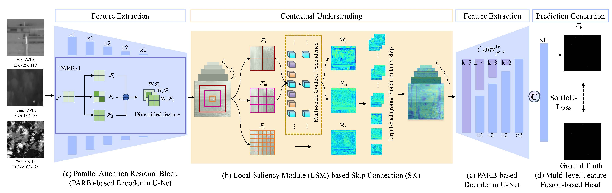

# TAMNet: Triple Adaptive Multiplexing Network for Wide-Area Infrared Small Target Detection
[点击这里查看文章](https://www.sciencedirect.com/science/article/pii/S0925231226007204)

# Requirements
Python 3<br>
pytorch 1.2.0 or higher<br>
numpy, PIL, tqdm, shutil<br>
# Algorithm Introduction
We propose a triple adaptive multiplexing network (TAMNet) for wide-area infrared small target detection (WIRSTD) in this paper. Experiments on the dataset provided by the PRCV2024 Wide Area Infrared Small Target Detection Challenge (hereafter PRCV2024) demonstrate the effectiveness of our method. The contributions can be summarized as follows:<br>
1. We propose TAMNet featuring dedicated adaptive multiplexing strategies in feature extraction, contextual understanding, and prediction generation to achieve exceptional cross-domain generalization for WIRSTD.<br>
2. We propose a novel attention-decoupled parallel attention residual block (PARB) module that adaptively integrates multi-branch features to maximally preserve and reinforce subtle features while effectively mitigating cross-domain feature distortion induced by attention mechanisms.<br>
3. We propose local saliency module (LSM) as a replacement for the skip connections (SK) to handle complex background variations by explicitly modeling multi-scale context to implicitly derive stable targetbackground relationships.<br>
# Commands
## Commands for training
Run `trainVMDNAL.py` to perform network training in single GPU and multiple GPUs.<br> 
Checkpoints and Logs will be saved to `./log/`, and the `./log/` has the following structure:<br>
```markdown
├──./log/<br> 
│    ├── PRCV2024<br> 
│    │    ├── VMDNAL_eopch400.pth.tar<br> 

